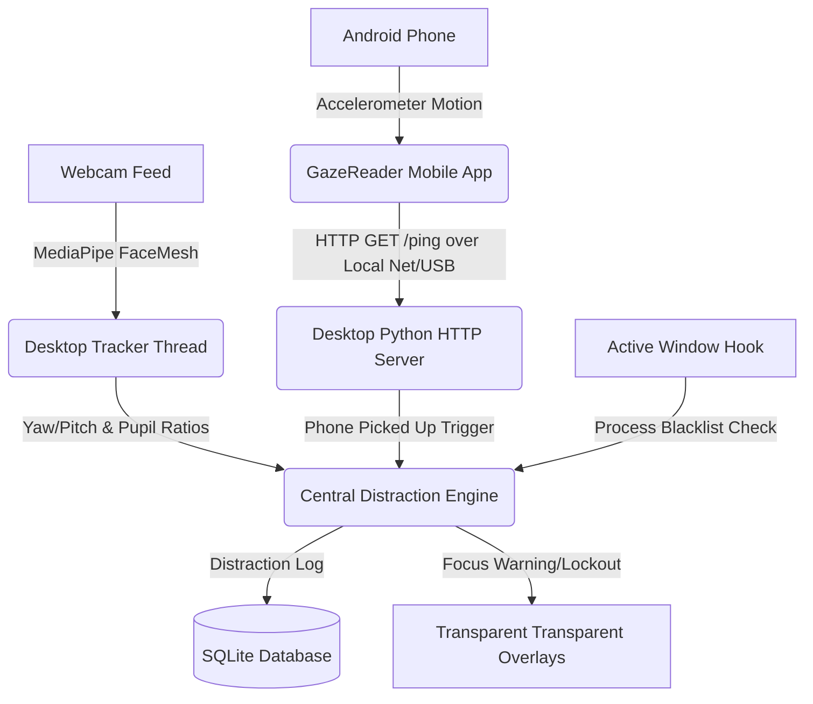

# 👁️ FocusSentry: AI-Powered Gaze Tracking & Phone Distraction Guard

[](LICENSE)
[](https://python.org)
[](https://github.com)
[](https://waziryaseen.gumroad.com/coffee)

**FocusSentry** is a real-time, AI-powered productivity companion that uses computer vision and physical motion sensors to eliminate distractions. By pairing a Windows desktop agent with an Android companion client, FocusSentry blocks your screen when you look away, roll your eyes, or pick up your mobile phone during a Pomodoro session.

---

## 🚀 Key Features

* **Real-time Gaze Tracking**: Uses MediaPipe FaceMesh to calculate head pose yaw/pitch offsets and lock the screen if you look away.
* **Horizontal Eye-Rolling Detection**: Extracted pupil ratios monitor horizontal glances, triggering alerts if you glance to the side.
* **Adaptive Posture Drift Tracker**: Automatically tares/re-centers baseline coordinates as you lean or slide, ensuring zero false-positive warnings while typing.
* **Android Motion Companion**: Integrates with your Android phone's accelerometer to instantly lock your desktop screen when the phone is picked up.
* **Process Blacklist Monitor**: Monitors active Windows application titles and locks the system if forbidden apps/websites (e.g., social media) are opened.
* **Silent Startup Mode**: Boots directly into the system tray, keeping your workspace clean until you're ready to configure.

---

## 🛠️ System Architecture



---

## ⚙️ Installation Guide

### 1. Windows Desktop App Setup

#### Requirements
* Python 3.9+ installed on your computer.
* A standard USB or built-in webcam.

#### Installation Steps
1. Clone this repository:
   ```bash
   git clone https://github.com/YOUR_USERNAME/FocusSentry.git
   cd FocusSentry
   ```
2. Install the required Python dependencies:
   ```bash
   pip install -r requirements.txt
   ```
3. Run the desktop application:
   ```bash
   python main.py
   ```

---

### 2. Android Mobile App Setup

FocusSentry uses a lightweight background service on your phone to send accelerometer data.

#### Installation Steps
1. Open the project inside `GazeReaderMobile/` folder using **Android Studio**.
2. Connect your Android phone to your computer with **USB Debugging** enabled.
3. Build and run the app on your phone.
4. Set up the connection:
   * **Wired (USB Connection)**: Run the desktop app, set the target IP on the phone to `127.0.0.1`, and turn on tracking. The desktop app will automatically route incoming packets.
   * **Wireless (Wi-Fi Hotspot)**: Turn on your Windows Mobile Hotspot, connect your phone to it, and enter your laptop's hotspot gateway IP (typically `192.168.137.1`).

---

## 📖 How to Use

1. **Set Baseline**: Click the `🎯 Set Center` button on the Desktop GUI while looking straight at your screen.
2. **Adjust Sensitivity**: Use the sliders in the Settings panel to set the warning countdown delays and Yaw/Pitch angles.
3. **Blacklist Applications**: Add distracting websites or app window names (e.g. `facebook`, `reddit`) to the blacklist card.
4. **Start Timer**: Click `Start Pomodoro` (or press **`Ctrl + Alt + P`** system-wide) to begin a 50-minute study session.
5. **Get Work Done**: If you look away, scroll your phone, or open blacklisted apps, transparent lockout overlays will block your monitors.

---

## 🛡️ License

This project is licensed under the MIT License - see the [LICENSE](LICENSE) file for details.

---

## ☕ Support My Work

If FocusSentry helped you stay focused and boost your productivity, consider supporting its development! 

You can buy me a coffee or make a custom contribution directly on my Gumroad support page:

[](https://waziryaseen.gumroad.com/coffee)
