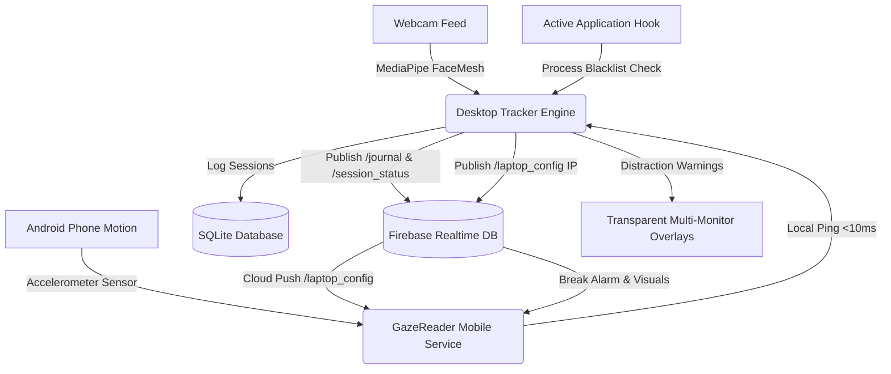

# FocusSentry (GazeReader)
### AI-Powered Gaze Tracking, Mobile Motion Guard & Cloud Analytics System

[](LICENSE)
[](https://python.org)
[](https://developer.android.com)
[](https://firebase.google.com)
[](https://waziryaseen.gumroad.com/coffee)

---

FocusSentry (GazeReader) is a productivity system that pairs an AI-powered computer vision agent on Windows with a Kotlin companion app on Android.

By combining MediaPipe facial gaze tracking, real-time desktop application monitoring, physical phone motion sensors, and Firebase Cloud Synchronization, FocusSentry protects study sessions, alerts to distractions, and provides analytics of study habits.

---

## Key System Features

### 1. Computer Vision & Gaze Tracking Agent (Desktop)
* **MediaPipe FaceMesh Tracking**: Real-time 3D head pose estimation monitoring Yaw (horizontal look-away) and Pitch (vertical look-away) angles.
* **Eye-Rolling & Glance Detection**: Extracted pupil ratios monitor horizontal glances, triggering warnings if looking away from the screen.
* **Adaptive Posture Drift Tracker**: Automatically tares and re-centers baseline coordinates as you shift posture, preventing false-positive warnings while typing.
* **Process & App Blacklist Guard**: Monitors active Windows application titles and locks the system if forbidden apps or websites (e.g. social media, entertainment) are opened.
* **Multi-Monitor Lockout Overlays**: Displays transparent lockout overlays across all connected monitors when focus is broken.

### 2. Android Mobile Companion App (GazeReaderMobile)
* **Physical Phone Pickup Detector**: Accelerometer monitoring detects phone movement during study sessions, sending a fast (<10ms) local ping to lock the desktop if the phone is picked up.
* **Hero 9-Hour Focus Target Ring**: Custom canvas target ring displaying active study percentage, daily focus duration, and target completion status badges.
* **High-Priority Break Alarm**: Synchronizes Pomodoro break timers over Firebase. When a break ends, the phone triggers a high-priority alarm notification with ringtone audio, vibration, and automatic sensor pause.
* **All-Time Horizontally Scrollable Analytics**: Stacked bar charts for 7-day Weekly and All-Time Monthly study trends:
  * **Hour-Based Y-Axis**: Tick marks in hours (0.0h, 2.0h, 4.0h, 6.0h, 8.0h, 10.0h).
  * **Direct Value Labels**: Focused duration (e.g. 4h 30m, 7h 15m) rendered directly above each daily bar.
  * **9-Hour Green Dashed Goal Line**: Emerald green horizontal dashed benchmark across the chart.
  * **Infinite Horizontal Swipe**: Swipe left through all historical study logs without losing past progress.

### 3. Automatic Laptop IP Discovery & Win32 Event Listener
* **Automatic Discovery**: When the laptop connects to a Wi-Fi or Hotspot network, it detects its active IPv4 address and publishes it to Firebase. The Android app syncs to it automatically.
* **Native Windows Event Listener (NotifyAddrChange)**: Uses Win32 API network change events to detect Wi-Fi network switches and re-publish updated IP targets instantly.

---

## System Architecture


```mermaid
graph TD
    A[Webcam Feed] -->|MediaPipe FaceMesh| B(Desktop Tracker Engine)
    C[Active Application Hook] -->|Process Blacklist Check| B
    
    D[Android Phone Motion] -->|Accelerometer Sensor| E(GazeReader Mobile Service)
    E -->|Local Ping <10ms| B
    
    B -->|Log Sessions| F[(SQLite Database)]
    B -->|Publish /journal & /session_status| G[(Firebase Realtime DB)]
    B -->|Publish /laptop_config IP| G
    
    G -->|Cloud Push /laptop_config| E
    G -->|Break Alarm & Visuals| E
    
    B -->|Distraction Warnings| H[Transparent Multi-Monitor Overlays]
```

---

## Installation & Setup Guide

### 1. Windows Desktop App Setup

#### Requirements
* Python 3.9+ on Windows 10/11.
* Standard webcam.

#### Steps
1. Clone the repository:
   ```bash
   git clone https://github.com/yaseen2/FocusSentry.git
   cd FocusSentry
   ```
2. Install Python dependencies:
   ```bash
   pip install -r requirements.txt
   ```
3. Launch the application:
   ```bash
   python main.py
   ```

---

### 2. Android Mobile App Setup (GazeReaderMobile)

#### Requirements
* Android device running Android 8.0+ (SDK 26+).
* Android Studio.

#### Steps
1. Open `GazeReaderMobile/` directory in Android Studio.
2. Connect Android phone via USB with USB Debugging enabled.
3. Build and install the APK to your phone:
   ```powershell
   gradlew assembleDebug
   adb install -r app/build/outputs/apk/debug/app-debug.apk
   ```
4. Open GazeReader Mobile on your phone.
5. Turn on Mobile Hotspot or connect your phone and laptop to the same Wi-Fi network.
6. The app automatically syncs your laptop's IP via Firebase and begins tracking.

---

## How to Use

1. **Set Baseline Pose**: Look directly at your screen and click `Set Center` (or press `Ctrl + Alt + A`).
2. **Configure Settings**: Adjust Yaw/Pitch angles, warning countdown delays, and motion sensitivity.
3. **Set Blacklist**: Add forbidden website keywords or app names (e.g. `facebook`, `reddit`, `steam`).
4. **Start Session**: Click `Start Pomodoro` (or press `Ctrl + Alt + P`) to start a 50-minute focus timer.
5. **Track Progress**: Open GazeReader Mobile on your phone to view the 9-hour target ring, daily focus totals, and monthly trends updating in real time.

---

## Global Hotkeys

| Hotkey | Action |
| :--- | :--- |
| **Ctrl + Alt + P** | Toggle Pomodoro Focus Session (Start / Pause) |
| **Ctrl + Alt + A** | Adapt Baseline Gaze Center Pose |

---

## License

This project is licensed under the MIT License - see the [LICENSE](LICENSE) file for details.

---

## Support

If FocusSentry helped you stay focused, eliminate phone distractions, and achieve your study goals, consider supporting its development:

[](https://waziryaseen.gumroad.com/coffee)
