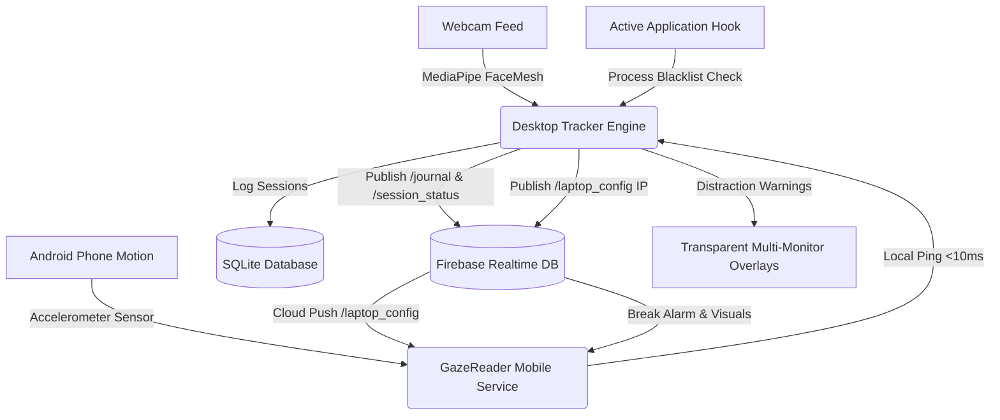

# 👁️ FocusSentry (GazeReader)
### AI-Powered Gaze Tracking, Mobile Motion Guard & Cloud Analytics System

[](LICENSE)
[](https://python.org)
[](https://developer.android.com)
[](https://firebase.google.com)
[](https://waziryaseen.gumroad.com/coffee)

---

**FocusSentry** (also known as **GazeReader**) is an advanced, real-time productivity ecosystem that pairs an AI-powered computer vision agent on Windows with a Kotlin companion app on Android. 

By combining MediaPipe facial gaze tracking, real-time desktop app hooks, physical phone motion sensors, and Firebase Cloud Synchronization, FocusSentry protects your focus sessions, alerts you to distractions, and provides deep visual analytics of your study habits.

---

## ✨ Key System Features

### 👁️ 1. Computer Vision & Gaze Tracking Agent (Desktop)
* **MediaPipe FaceMesh Tracking**: Real-time 3D head pose estimation monitoring Yaw (horizontal look-away) and Pitch (vertical look-away) angles.
* **Eye-Rolling & Glance Detection**: Extracted pupil ratios monitor horizontal glances, triggering instant warnings if you look to the side.
* **Adaptive Posture Drift Tracker**: Automatically tares and re-centers baseline coordinates as you lean or adjust your chair posture, preventing false-positive warnings while typing.
* **Process & App Blacklist Guard**: Monitors active Windows application titles and locks the system if forbidden apps/websites (e.g. social media, entertainment) are opened.
* **Multi-Monitor Lockout Overlays**: Spawns transparent, high-contrast lockout overlays across all connected monitors when focus is broken.

### 📱 2. Android Mobile Companion App (`GazeReaderMobile`)
* **Physical Phone Pickup Detector**: Hardware accelerometer monitoring detects physical phone movement during study sessions, sending an instant `<10ms` local ping to lock the desktop if you touch your phone.
* **Hero 9-Hour Focus Target Ring**: Vector-painted custom canvas target ring (`MobileFocusCircleView`) displaying your active study percentage (`52%`), daily focus duration (`4h 42m / 9h`), and glowing status badges (`● ON TARGET TODAY` / `QUEST COMPLETED 🏆`).
* **High-Priority Break Alarm**: Synchronizes Pomodoro break timers over Firebase. When a break ends, your phone triggers a high-priority alarm notification with ringtone audio (`TYPE_ALARM`), vibrating pattern, and smart accelerometer auto-pause.
* **All-Time Horizontally Scrollable Analytics**: Stacked bar charts (using MPAndroidChart) for 7-day Weekly and All-Time Monthly study trends. Features:
  * **Hour-Based Y-Axis**: Clear tick marks in hours (`0.0h`, `2.0h`, `4.0h`, `6.0h`, `8.0h`, `10.0h`).
  * **Direct Value Labels**: Focused duration (`4h 30m`, `7h 15m`) rendered directly above each daily bar.
  * **9-Hour Green Dashed Goal Line**: Emerald green horizontal dashed benchmark (`🎯 9h Goal`) across the chart.
  * **Infinite Horizontal Swipe**: Swipe left back in time through all historical study logs without losing past progress.

### ⚡ 3. Automatic Laptop IP Discovery & Win32 Event Listener
* **Zero Manual Typing**: Whenever your laptop starts or connects to a Wi-Fi/Hotspot network, it automatically detects its active IPv4 address and publishes it to Firebase (`/laptop_config`). Your Android app automatically syncs to it in real time!
* **Native Windows Event Listener (`NotifyAddrChange`)**: Uses Win32 API network change events to detect Wi-Fi network switches in 0 milliseconds and re-publish updated IP targets instantly.

---

## 🛠️ System Architecture


```mermaid
graph TD
    A[Webcam Feed] -->|MediaPipe FaceMesh| B(Desktop Tracker Engine)
    C[Active Application Hook] -->|Process Blacklist Check| B
    
    D[Android Phone Motion] -->|Accelerometer Sensor| E(GazeReader Mobile Service)
    E -->|Local Ping <10ms| B
    
    B -->|Log Sessions| F[(SQLite Database)]
    B -->|Publish /journal & /session_status| G[(Firebase Realtime DB)]
    B -->|Publish /laptop_config IP| G
    
    G -->|Cloud Push /laptop_config| E
    G -->|Break Alarm & Visuals| E
    
    B -->|Distraction Warnings| H[Transparent Multi-Monitor Overlays]
```

---

## ⚙️ Installation & Setup Guide

### 1. Windows Desktop App Setup

#### Requirements
* Python 3.9+ installed on Windows 10/11.
* Standard built-in or USB webcam.

#### Steps
1. Clone the repository:
   ```bash
   git clone https://github.com/yaseen2/FocusSentry.git
   cd FocusSentry
   ```
2. Install Python dependencies:
   ```bash
   pip install -r requirements.txt
   ```
3. Launch the application:
   ```bash
   python main.py
   ```

---

### 2. Android Mobile App Setup (`GazeReaderMobile`)

#### Requirements
* Android device running Android 8.0+ (SDK 26+).
* Android Studio (for compilation).

#### Steps
1. Open the `GazeReaderMobile/` directory in **Android Studio**.
2. Connect your Android phone via USB with **USB Debugging** enabled.
3. Build and install the APK to your phone:
   ```powershell
   gradlew assembleDebug
   adb install -r app/build/outputs/apk/debug/app-debug.apk
   ```
4. Open **GazeReader Mobile** on your phone.
5. Turn on **Mobile Hotspot** or connect your phone and laptop to the same Wi-Fi network.
6. The app will automatically sync your laptop's IP via Firebase and begin tracking!

---

## 📖 How to Use

1. **Set Baseline Pose**: Look directly at your screen and click `🎯 Set Center` (or press **`Ctrl + Alt + A`**).
2. **Configure Settings**: Adjust Yaw/Pitch angles, warning countdown delays, and motion sensitivity.
3. **Set Blacklist**: Add forbidden website keywords or app names (e.g. `facebook`, `reddit`, `steam`).
4. **Start Session**: Click `Start Pomodoro` (or press **`Ctrl + Alt + P`**) to start your 50-minute focus timer.
5. **Track Progress**: Open **GazeReader Mobile** on your phone to watch your 9-hour target ring, daily focus totals, and monthly trends update in real time.

---

## ⌨️ Global Hotkeys

| Hotkey | Action |
| :--- | :--- |
| **`Ctrl + Alt + P`** | Toggle Pomodoro Focus Session (Start / Pause) |
| **`Ctrl + Alt + A`** | Adapt Baseline Gaze Center Pose |

---

## 🛡️ License

This project is licensed under the MIT License - see the [LICENSE](LICENSE) file for details.

---

## ☕ Support My Work

If FocusSentry helped you stay focused, eliminate phone distractions, and achieve your daily study goals, consider supporting its development!

[](https://waziryaseen.gumroad.com/coffee)
